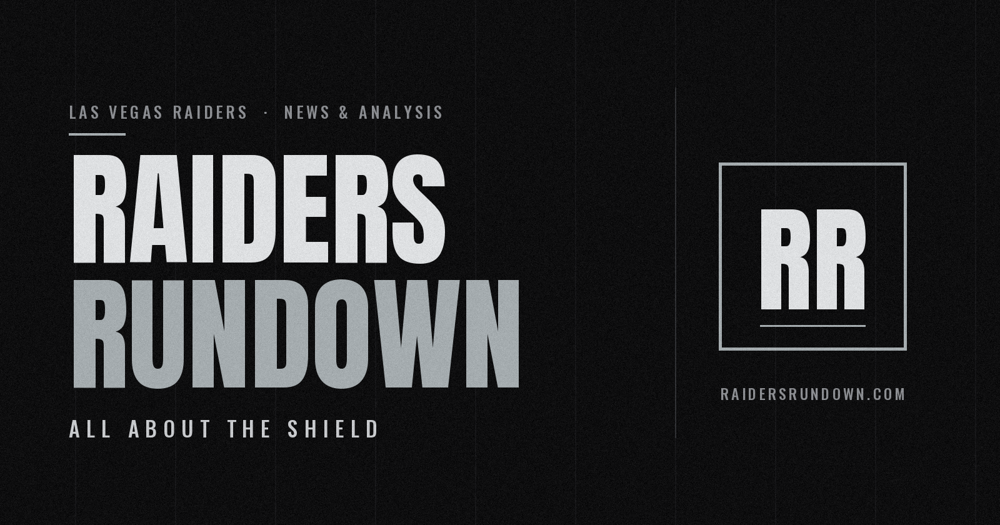

<div align="center">

<a href="https://www.raidersrundown.com">
  
</a>

<br />
<br />

**News, analysis, power rankings, and predictions graded in public.**<br />
An independent Las Vegas Raiders blog, built from scratch.

<br />

[](https://www.raidersrundown.com)
[](https://www.raidersrundown.com/predictions)
[](https://www.raidersrundown.com/games)


[What's inside](#whats-inside) &nbsp;•&nbsp; [The Prediction Scoreboard](#the-prediction-scoreboard) &nbsp;•&nbsp; [How it's built](#how-its-built) &nbsp;•&nbsp; [Run it locally](#run-it-locally) &nbsp;•&nbsp; [Project map](#project-map)

</div>

---

## What is this?

**Raiders Rundown** is a fan-run Raiders site with a simple rule: say what you think, put it on the record, and let the results grade you. It covers the team the way a beat site would (news, film study, weekly power rankings, full game recaps) and then goes a step further by publishing every game pick and season prediction up front and scoring them in public.

Everything you read on the site is written in [Sanity](https://www.sanity.io) and rendered by a Next.js App Router app. The editing Studio lives inside the same codebase at `/studio`, so one push ships both the site and the content model.

> Independent fan project. Not affiliated with, endorsed by, or sponsored by the NFL or the Las Vegas Raiders.

## What's inside

| | |
|---|---|
| **Articles and power rankings** | Long-form posts with rich text, categories, related posts, share buttons, reactions, and a comment section with moderation. |
| **Game reports** | A recap page per game: box score, game leaders, a play-by-play timeline, video embeds, player of the game (with reader voting), a reader poll, and previous/next navigation through the season. |
| **Live threads** | A live game-day feed that refreshes itself while a thread is marked live. Posts can be added fast from a private quick-post page. |
| **Prediction Scoreboard** | Weekly picks graded in public, anonymous reader picks, and win-total predictions for all 32 teams. [Details below.](#the-prediction-scoreboard) |
| **Community** | A discussion hub that surfaces the most-discussed articles and recaps across the site, plus where fans are talking Raiders elsewhere. |
| **Search, categories, dark mode** | Live article search and category filtering on the homepage, and a light/dark theme. |
| **Built to be shared** | Per-post and per-game Open Graph and Twitter cards, canonical URLs, and a branded default share image, so links look right on X. |

## The Prediction Scoreboard

The page at [`/predictions`](https://www.raidersrundown.com/predictions) is the part of the site that holds the author accountable.

- **Scoreboard.** Pick accuracy as a headline number with a meter, overall and Raiders-only record, current hit/miss streak, average margin miss, and the last twelve results at a glance.
- **Weekly picks.** One card per game with the predicted score, the final score once it's in, how far off the margin was, and a link to the full recap. Every pick is graded on the winner (hit, miss, or push) and on margin error.
- **Readers vs. the author.** Readers pick a winner before kickoff with no account needed. Voting locks at kickoff, and the board tracks "Me vs. the readers" on the games where readers had a clear favorite.
- **All 32 teams.** Season win-total predictions for the whole league, shown against each team's real record on a 17-game pace bar. Each team gets a status (still alive, too many wins, too many losses, hit, close, or missed), and the table filters by conference or division.

Status is never conveyed by color alone: every result pairs a shape and a text label with its color, so the board stays readable in grayscale and for color-blind readers.

**Updating it takes about a minute per game.** In the Studio, create a *Game Prediction* before kickoff. After the final, type in the two final scores and the site does all the grading, streaks, and margin math. Season picks live in a single *Season Predictions* document that is pre-filled with all 32 teams.

The grading logic is a pure, framework-free module ([`lib/predictions.ts`](lib/predictions.ts)), so it is easy to read and to test on its own.

## How it's built

```
 Sanity Studio (/studio)          Next.js 13 App Router            Reader
 ───────────────────────          ─────────────────────            ──────
 posts, game reports,   ──GROQ──▶  server components   ──HTML──▶  site
 live threads, picks,              ISR + force-dynamic
 comments, season picks            pages/api routes   ◀──votes──  polls, picks,
                                   (atomic counters)               reactions
```

- **Framework.** Next.js 13.2 with the App Router (`app/`), plus a handful of classic API routes (`pages/api/`) for votes, comments, and live posting.
- **Content.** Sanity v3 with the Studio embedded in the app. Schemas live in [`schemas/`](schemas) and include posts, game reports, live events, game predictions, season predictions, authors, categories, comments, and rich text.
- **Styling.** Tailwind CSS with a small shadcn-style token system (`bg-background`, `text-muted-foreground`, and friends), Inter for body text, and Fraunces for headlines. Icons come from `lucide-react`.
- **Rendering strategy.** Article and game pages are statically generated and refreshed every 60 seconds. Index pages and the scoreboard render on every request so new results and votes show up immediately.
- **Votes.** Reader polls, player-of-the-game votes, and prediction picks all use Sanity's atomic `inc` patches so concurrent votes never overwrite each other. The prediction route also refuses votes after kickoff or after a result is entered.
- **One caveat, stated plainly.** Reader votes are anonymous and de-duplicated per browser, so they are a fun pulse check, not a tamper-proof ballot.

## Run it locally

You need Node 24 and Yarn (the repo pins Yarn 4 through `packageManager`).

```bash
# 1. Install
yarn install

# 2. Add your environment variables (see below) to .env.local

# 3. Start the dev server
yarn dev
```

Then open [http://localhost:3000](http://localhost:3000) for the site and [http://localhost:3000/studio](http://localhost:3000/studio) for the Studio.

### Environment variables

Create a `.env.local` in the project root:

| Variable | Required | What it's for |
|---|---|---|
| `NEXT_PUBLIC_SANITY_PROJECT_ID` | Yes | Your Sanity project ID. |
| `NEXT_PUBLIC_SANITY_DATASET` | Yes | The dataset to read from, for example `production`. |
| `NEXT_PUBLIC_SANITY_API_VERSION` | Yes | Sanity API version date. |
| `NEXT_SANITY_TOKEN` | For writes | A token with **Editor** permission. Needed for votes, comments, and live posting. Reads work without it on a public dataset. |
| `NEXT_PUBLIC_VERCEL_LINK` | Production | The deployed site URL, used in Studio preview links. |
| `LIVE_POST_SECRET` | For live posting | A shared secret that protects the private quick-post page. |

Never commit `.env.local`, and rotate the token if it is ever exposed.

### Scripts

| Command | What it does |
|---|---|
| `yarn dev` | Run the site and Studio locally. |
| `yarn build` | Production build. |
| `yarn start` | Serve the production build. |

## Project map

```
app/
  (user)/                 the public site
    page.tsx              homepage
    post/[slug]/          articles and power rankings
    games/                game report index and [slug] recap pages
    live/                 live game-day threads
    predictions/          the Prediction Scoreboard
    community/            discussion hub
  (admin)/
    studio/               embedded Sanity Studio
    live-post/            private quick-post page
components/
  predictions/            scoreboard hero, pick cards, 32-team tracker
  ui/                     shared primitives (cards, badges, buttons)
lib/
  predictions.ts          pure grading logic: hits, misses, streaks, margins
  nfl.ts                  the 32 teams, shared by the site and the Studio
  sanity.client.ts        read-only and write Sanity clients
pages/api/                vote, comment, and live-post endpoints
schemas/                  Sanity content model
public/                   static assets, including the default share image
```

## Deploying

The site is built for [Vercel](https://vercel.com). Connect the repo, add the environment variables above, and every push to `main` deploys. Because the Studio ships inside the app, content-model changes go out with the same deploy.

---

<div align="center">

Built by [Hunter Macias](https://www.raidersrundown.com) &nbsp;•&nbsp; All about the shield.

</div>
